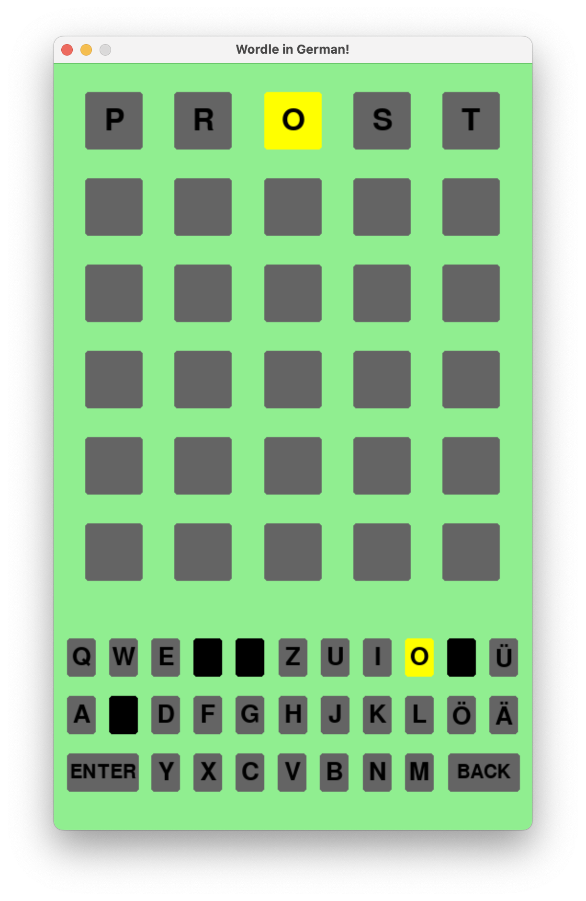

# German Wordle Clone
## About this Project
This project is written in Python and utilizes the [pygame library](https://www.pygame.org/news) to create a user interface for the game. Additionally, I downloaded the raw text file from the [german-wordlist repository](https://github.com/enz/german-wordlist) for a list of German word that I then parsed to create a new text file of only five leader words. Finally, I used the Google Translator API from the the [deep-translator python package](https://pypi.org/project/deep-translator/#google-translate-1) to translate the German word at the end of the game.
## How to Play
The game follows the simple pattern of the popular word game, Wordle. The goal is to guess a five letter word.
1. A player guesses any five letter word.
2. The letters are highlighted in different colors to signify success or failure in guessing.
    - Any word that **is not** a valid German five letter word will appear red and not be accepted. The player must guess again.
      - 
    - If valid, any letter that is in the goal word but in the **incorrect** place will be yellow.
      - 
    - If it is valid, any letter in the goal word that is in the **correct** place will be green.
      - 
    - If it is not in the goal word at all, no color will change.
3. The player continues to guess until they find the correct word, or they have guessed six valid five letter German words. 
   -  
